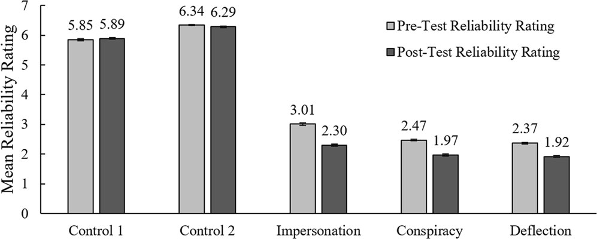

<br>

**Original article:**\
Fake news game confers psychological resistance against online misinformation\
Jon Roozenbeek & Sander van der Linden\
Palgrave Commun 5, 65 (2019).\
<https://doi.org/10.1057/s41599-019-0279-9> <br>\

**Repository with this analysis, the write-up, and related files:**\
<https://osf.io/z7mg4/> <br>\

**Key for this analysis:**\
✅ No problems found\
⚠️ Concern or error that does not substantially impact the conclusions\
🚩 Concern or error that calls the conclusions into question

# Setup

```{r setup, message = FALSE, warning = FALSE}
library(tidyverse)
library(report) # report statistics
library(effectsize) # cohens_d() and hedges_g()
library(glue) # string formatting
library(scales) # display percent
library(lmerTest) # lmer() and anova()
# library(rms) # for ordinal regression (overrides functions we don't want overriden)
```

Helper functions:

```{r helper_functions, class.source = 'fold-hide'}
# implementing the article's 95% CI approach
standard_error = function(x) sqrt(var(x,na.rm=TRUE)/length(na.omit(x)))
ci = function(x, confidence.interval=0.95) standard_error(x) * qnorm(1 - (1-confidence.interval)/2)

# Hedges'
hedges_g_av = function(a, b) {
  if (length(a) != length(b))
    error("hedges_g_av: vectors are not the same length")
  n = length(a)
  mean_1 = a %>% mean()
  mean_2 = b %>% mean()
  sd_1 = a %>% sd()
  sd_2 = b %>% sd()
  
  (mean_2 - mean_1) / (sd_1/2 + sd_2/2)
}

# report p-value
report_p_value = function(p, digits = 4) {
  ifelse(p < 10^-digits, 
    ifelse(p < 10^-16,
      glue("p < {10^-16}"),
      glue("p = {signif(p, digits = 1)}")),
      glue("p = {formatC(p, format = 'f', digits = digits)}")
  )
}

# pulled from the {report} package and customized to match the article
report_statistics_ttest <- function(x, table = NULL, data = NULL, formula = NULL, ...) {
  model_info <- list(...)$model_info
  if (is.null(model_info)) {
    model_info <- suppressWarnings(insight::model_info(x, verbose = FALSE))
  }
  if (is.null(table) || is.null(attributes(table)$effsize)) {
    table <- report::report_table(x, data = data, model_info = model_info)
  }

  effsize <- attributes(table)$effsize
  text <- NULL

  # Estimate
  candidates <- c(
    "rho", "r", "tau", "Difference", "r_rank_biserial",
    "Chi2", "Odds Ratio"
  )
  estimate <- candidates[candidates %in% names(table)][1]
  if (!is.null(estimate) && !is.na(estimate)) {
    text <- paste0(tolower(estimate), " = ", insight::format_value(table[[estimate]]))
  }

  # CI
  if (!is.null(attributes(x$conf.int)$conf.level)) {
    text <- paste0(
      text,
      ", ",
      insight::format_ci(
        table$CI_low,
        table$CI_high,
        ci = attributes(x$conf.int)$conf.level
      )
    )
  }

  # Statistic
  if ("t" %in% names(table)) {
    text <- paste0(
      text,
      ", t(",
      insight::format_value(table$df, protect_integers = TRUE),
      ") = ",
      insight::format_value(table$t)
    )
  } else if ("S" %in% names(table)) {
    text <- paste0(text, ", S = ", insight::format_value(table$S))
  } else if ("z" %in% names(table)) {
    text <- paste0(text, ", z = ", insight::format_value(table$z))
  } else if ("W" %in% names(table)) {
    text <- paste0("W = ", insight::format_value(table$W))
  }

  # p-value
  p_text = report_p_value(table$p, digits = 4)
  text <- paste0(text, ", ", p_text)

  # Effect size
  if (model_info$is_ttest || (model_info$is_ranktest && !model_info$is_correlation) ||
    model_info$is_chi2test) {
    
    if (!is.null(data) && is.numeric(data) && model_info$is_ttest) {
      # calculate Cohen's d
      d = effectsize::cohens_d(data)$Cohens_d
      d = insight::format_value(d)
      # calculate Hedges' g
      g = effectsize::hedges_g(data)$Hedges_g
      g = insight::format_value(g)
      text_full = glue("{text}; d<sub>z</sub> = {d}; Hedges' g<sub>z</sub> = {g}")
    } else if (!is.null(formula) && is.data.frame(data) && model_info$is_ttest){
      # calculate Cohen's d
      d = effectsize::cohens_d(formula, data=data)$Cohens_d
      d = insight::format_value(d)
      # calculate Hedges' g
      g = effectsize::hedges_g(formula, data=data)$Hedges_g
      g = insight::format_value(g)
      text_full = glue("{text}; d<sub>z</sub> = {d}; Hedges' g<sub>z</sub> = {g}")
    } else {
      text_full = paste0(text, "; ", attributes(effsize)$statistics)
    }
  } else {
    text_full = text
  }

  as.report_statistics(text_full,
    summary = text,
    estimate = table[[estimate]],
    table = table,
    effsize = effsize
  )
}
```

# Load data and tidy

```{r load, message=FALSE, warning=FALSE}
data_raw = read_csv("data/BadNewsGame_Palgrave.csv")
```

```{r debug, include=FALSE}
# for quicker debugging:
#data_raw = data_raw %>% slice_head(n = 5000)
```

```{r tidy}
# tidy up the data
data = data_raw %>% 
  # add subject ID and move it to the first column
  mutate(subjectID = glue("S{1:n()}")) %>% 
  relocate(subjectID) %>% 
  # pivot longer to one response per row
  pivot_longer(pre_impersonation:post_control2, names_to = "category", values_to = "response") %>% 
  # separate "pre"-vs-"post" from category name
  separate(category, c("order", "category"), sep = "_") %>% 
  # pivot wider for pre and post on same row
  pivot_wider(names_from = order, values_from = response)

# match article's category order
data = data %>% 
  mutate(category = factor(category, 
    levels = c("control1", "control2", "impersonation", "conspiracy", "deflection"),
    labels = c("Control 1", "Control 2", "Impersonation", "Conspiracy", "Deflection")))
```

```{r pre_post_delta}
# delta = change from pre to post
data = data %>%  
  mutate(delta = post - pre)

# the question has both a pre and post response for this subject?
data = data %>% 
  mutate(has_both = !is.na(delta))

# is the category a control?
data = data %>% 
  mutate(is_control = str_detect(category, fixed("control", ignore_case=TRUE)))
```

```{r paired}
# only responses with matching pre and post
data_paired = data %>% filter(has_both)
```

```{r}
data_all = data %>% 
  mutate(
    .by = subjectID,
    paired_count = sum(has_both) # how many paired responses?
  ) %>% 
  # only subjects with the max number of paired responses
  filter(paired_count == max(paired_count))
```

# Replicability & Reproducibility

## 🚩 Source code

The study uses a custom-made interactive website ([www.getbadnews.com](www.getbadnews.com)) to collect data and present stimuli. The availability of a live version of this site is very informative for readers. Unfortunately, the source code is not shared, especially for the back end, which limits the scrutinizability of the data collection process and requires that any replication must overcome the hurdle of recreating the site.

## 🚩 Exact stimuli

The only way to see the stimuli and full procedures is to go through the interactive website. The full study content (i.e. instructions, training prompts, feedback, and overall appearance) is not available in any document with persistent storage. If the website changes (apparently, it has already been changed in undocumented ways since data collection) or if it is ever taken down (inevitable in the long-term), it will be impossible to create an exact replication of this study's methods.

It is important to understand that this article's primary claim is that its interventions "inoculate" against susceptibility to misinformation. But the original unmodified version of those interventions is not available for scrutiny.

## 🚩 Data availability

> The data that support the findings of this study are available from <https://doi.org/10.6084/m9.figshare.8269763>.

**Minor clarity issue 1**: The data is available as a CSV file via a link in the article's data availability section. Unfortunately, no data dictionary is available. However, the column headers are fairly clear, so it is not a serious problem.

**Minor clarity issue 2**: The polartisation data is not in the same repository, so I needed the author's help to find it. At the bottom of the main repository's metadata is a link with the label "URL - References". That link leads to another repository with the polarisation data as another CSV file.

**Not raw data**: These CSV files do not appear to be the raw data, as they have been processed in some unknown way. I inspected network requests sent by current version of the study website ([www.getbadnews.com](https://www.getbadnews.com)) and found that the site sends a subject's collected data to the server via a JSON file using an HTTP POST request ([example upload](https://osf.io/hjqde)). This JSON contains more information than the CSV such as question order, training questions, examples, and responses during training. The only potentially identifying information in the JSON is the "agent string", which states the subject's operating system and browser version. It could easily be removed or simplified allowing for sharing of the raw data without ay privacy risk for the subjects.

The code used to covert each raw JSON into a row in the CSV is not shared. Consequently, that process cannot be scrutinized for bugs, and any potential deviation of the CSV from the raw data are unknowable. Are all the responses reported? Are they modified in some way? Are there any encoding bugs? We don't know.

## ⚠️ Technical issues

Some technical limitations are mentioned in the article that raise concerns about the reliability of the data collection process.

> Due to bandwidth and data storage limitations, the treatment questions reflected a random sample of the strategies included in the game: impersonation, conspiracy, and discrediting.

> due to technical (storage) issues, data for the polarisation badge was not collected in the original launch

It is not clear what storage or bandwidth issues could have arisen, given that one subject's JSON data is under 30KB. Even with all \~45,000 responses, the total size of the raw data would be \~1.4 GB, which would easily fit in even the most basic server's storage quota and would fit in an OSF repository.

Moreover, while I have made my share of data collection mistakes over the years, I don't understand how the dropped polarisation response wasn't detected and corrected early in the data collection process. Then the survey could have been restarted with all responses recorded. Without access to the code, it is impossible to assess the nature or impact of these technical issues.

# Data sanity checks

## ⚠️ Post-test without pre-test

`r data %>% summarise(.by = subjectID, post_not_pre = any(is.na(pre) & !is.na(post))) %>% filter(post_not_pre) %>% nrow() %>% prettyNum(big.mark = ",")` subjects had post-test responses without corresponding pre-test responses. I asked one of the authors, who stated that because both the pre and post tests were voluntary, some subjects likely turned down volunteering for the study in the beginning but continued anyway and volunteered for the post test.

These subjects were excluded from the analyses, and the article clearly states that only paired data was analyzed. However, the article does not indicate that it was possible to only have post-test responses.

```{r post_without_pre, class.source = 'fold-hide'}
# how many subjects had a missing pre response but did have a corresponding a post response?
data %>% 
  summarise(
    .by = subjectID, 
    post_not_pre = any(is.na(pre) & !is.na(post))
  ) %>% 
  filter(post_not_pre) %>% 
  nrow()
```

## ⚠️ Same response every time

There are many approaches to check for nonsensical or inattentive responses. An example of nonsensical responses would be responding the same way every time without considering the question.

How many subjects responded with the same number every time?

```{r zero_variance, df_print="paged", class.source = 'fold-hide'}
zero_variance_count = data_all %>% 
  # calculate response range for subjects who responded to all questions
  mutate(
    .by = subjectID, 
    range = max(c(pre, post))-min(c(pre, post)), 
    pre_range = max(pre)-min(pre), 
    post_range = max(post)-min(post)
  ) %>% 
  # only subjects with 0 range
  filter(range == 0) %>% 
  # how many unique subjects?
  pull(subjectID) %>% 
  unique() %>% 
  length()

# number of subjects who responded to all questions
subjects_with_all_responses_count = data_all %>% 
  pull(subjectID) %>% 
  unique() %>% 
  length()

# proportion of subjects with zero response variance
zero_variance_prop = zero_variance_count / subjects_with_all_responses_count
```

Only `r zero_variance_count` subjects (`r scales::percent(zero_variance_prop, accuracy=0.1)` of subjects who responded to all questions) had unchanging responses, which is small enough that it is unlikely to substantively impact the results. Some of them may even be legitimate. However, some sort of attention check such as a question with an explicitly right and wrong answer would have helped delineate legitimate uniform responders from those who didn't consider the questions.

# Sample size

## ⚠️ Response count

Despite trying multiple definitions for what constitutes a response or what starting the survey means, I could not exactly reproduce the reported N.

**Article**: "we collected N = 43,687 responses"

**Supplemental material**: "In total, N = 43,687 participants started the survey"

**Reanalyzed counts**:

1)  How many subjects started the survey?

```{r class.source = 'fold-hide'}
data_raw %>% nrow()
```

2)  How many subjects have at least one response (pre-test or post-test)?

```{r class.source = 'fold-hide'}
N_any = data %>% 
  summarise(.by = subjectID, any_values = any(!is.na(pre) | !is.na(post))) %>% 
  filter(any_values) %>% 
  nrow()
N_any
```

3)  How many subjects have at least one pre-test response?

```{r class.source = 'fold-hide'}
N_pre = data %>% 
  summarise(.by = subjectID, any_pre = any(!is.na(pre))) %>% 
  filter(any_pre) %>% 
  nrow()
N_pre
```

4)  How many subjects have at least one post-test response?

```{r class.source = 'fold-hide'}
data %>% 
  summarise(.by = subjectID, any_post = any(!is.na(post))) %>% 
  filter(any_post) %>% 
  nrow()
```

None of these numbers perfectly match the reported response count of N = 43,687. The closest reproduced value to what the article reports is (3) the number of subjects with at least one pre-test response: `r prettyNum(N_pre, ",")`. However, the one digit is incorrect (8 in the article, 9 in this calculation).

Nevertheless, I can't work out a good rationale for reporting the number of subjects with pre-test responses because some subjects have post-test responses without any pre-test responses. So a more appropriate N would be the number of subjects who responded to at least one question: `r prettyNum(N_any, ",")`

## ⚠️ Paired response count

The number of subjects with usable data also has reporting issues. The abstract and methods list different numbers:

**Abstract**: "We conducted a large-scale evaluation of the game with N = 15,000 participants."

**Methods**: "which included n = 14,266 completed paired pre-post responses"

**Reanalyzed counts**:

1)  How many subjects have at least one question with a paired (pre-test and post-test) response?

```{r class.source = 'fold-hide'}
n = data_paired$subjectID %>% unique() %>% length()
n
```

2)  How many subjects have all responses?

```{r class.source = 'fold-hide'}
data_all$subjectID %>% unique() %>% length()
```

3)  How many subjects have paired responses for each question? The article reports "n = 14,163 to n = 14,266".

```{r class.source = 'fold-hide'}
data %>% summarise(
  .by = category,
  paired_count = sum(has_both)
) %>% 
  arrange(paired_count)
```

The number from the abstract (15,000) appears to be a coarse approximation. And the number from the methods (14,266) is NOT the number of subjects with "completed paired pre-post responses". Instead, it is a more convoluted value of *the highest number of paired responses for a single question (Control 2)*. However, there are subjects with paired responses to other questions besides control2 whose data were analyzed.

How many subjects do not have a paired response for Control 2 but have a paired response for another question? In other words, how much bigger should the reported n be?

```{r no_control2_but_yes_other, class.source = 'fold-hide'}
data_paired %>% 
  summarise(
    .by = subjectID,
    paired_control2 = "Control 2" %in% category,
    paired_other = any(category != "Control 2")
  ) %>% 
  filter(!paired_control2 & paired_other) %>% 
  nrow()
```

The number of subjects whose data was used in the analyses (n = `r prettyNum(n, ",")`) would probably be the most useful value to present to readers.

# Per-question analyses

## ✅ Descriptive statistics

Filtering out all empty or non-paired responses, I reproduced the description of means and ranges per question. Although the article notes that the error bars are 95% confidence intervals (CIs), it does not indicate which CI approach was used. One of the authors confirmed via email that these 95% CIs are a multiple of the standard error.

**Article's figure 5:**



**Reproduced figure 5:**

```{r descriptive_graph, fig.height=4*.9, fig.width=10*.9, class.source = 'fold-hide'}
descriptive_stats = data_paired %>% 
  pivot_longer(pre:post, names_to = "order", values_to = "response") %>% 
  summarise(
    .by = c(category, order),
    lo = mean(response) - ci(response),
    hi = mean(response) + ci(response),
    response = mean(response)
  ) %>% 
  mutate(order = factor(order, levels = c("pre", "post"), 
                        labels = c("Pre-Test Reliability Rating", "Post-Test Reliability Rating")))

ggplot(descriptive_stats) +
  aes(x = category, y = response, ymin = lo, ymax = hi, fill = order) +
  geom_col(width = .5, color = "black", position = position_dodge(width = .6)) +
  geom_text(family = "serif", size=17/.pt, vjust = -1, position = position_dodge(width = .6),
    aes(label = formatC(response, format="f", digits = 2))) +
  geom_errorbar(width = 0.1, position = position_dodge(width = .6)) +
  scale_y_continuous(expand = c(0,0), limits = c(0,7), breaks = 0:7) +
  scale_fill_grey(start = 0.75, end = 0.35) +
  coord_cartesian(clip = "off") + 
  theme_classic(17, base_family = "serif") + 
  theme(legend.position = "inside", legend.position.inside = c(.8,.8), 
        axis.text = element_text(size = rel(1), color = "black"),
        axis.text.y = element_text(margin = margin(0, 10, 0, 0)),
        axis.ticks.x = element_line(color=NA), axis.ticks.length.y = unit(-0.15, "cm"), 
        legend.text = element_text(size = rel(1)),
        legend.key.size = unit(.9, "lines"),
        legend.key.spacing.y = unit(1, "lines"), 
        plot.margin = margin(.5, .25, .5, .25, "cm")) +
  labs(x = NULL, fill = NULL, y = "Mean Reliability Rating")
```

An important caveat for this graph is that while the nominal averages can be informative, the graph does not show the within-subject relative responses.

## ⚠️ Per-question t-tests

**Results from the article**:

> Although statistically significant, there were no meaningful differences in the pre-scores and post-scores of the “real” control headlines participants were presented with surrounding Donald Trump (control1), *M*pre = 5.85, *M*post = 5.89, *M*diff = 0.04, [95% CI 0.02, 0.06], *t*(14204) = 3.78, *p* *=* 0.002, *d* *=* 0.03, Hedges *g* = 0.02 and Brexit (control2), *M*pre = 6.34, *M*post = 6.29, *M*diff = −0.05, [95% CI −0.03, −0.07], *t*(14265) = −5.13, *p* *\<* 0.0001, *d* *=* 0.04, Hedges *g* = 0.04. In contrast, there were both statistically significant and much larger differences in the pre-scores and post-scores for the fake tweets and headlines for each of the badges. Specifically, there was a significant decrease in reliability ratings for impersonation, *M*pre = 3.00, *M*post = 2.30, *M*diff = −0.71, [95% CI −0.67, −0.74], *t*(14224) = −43.42, *p* *\<* 0.0001, *d* *=* 0.36, Hedges *g* = 0.33, conspiracy, *M*pre = 2.47, *M*post = 1.97, *M*diff = −0.50, [95% CI −0.48, −0.53], *t*(14217) = −41.83, *p* *\<* 0.0001, *d* *=* 0.35, Hedges *g* = 0.32 and deflection, *M*pre = 2.37, *M*post = 1.92, *M*diff = −0.45, [95% CI −0.43, −0.48], *t*(14162) = −35.94, *p* *\<* 0.0001, *d* *=* 0.30, Hedges *g* = 0.26. Notably, although political polarisation is an important element of online misinformation, due to technical (storage) issues, data for the polarisation badge was not collected in the original launch. However, post-hoc data collection (*N* = 1770, *n* = 885 paired) allowed for an initial evaluation, which suggests a somewhat lower but still significant inoculation effect for polarising headlines, *M*pre = 2.57, *M*post = 2.30, *M*diff = −0.26, [95% CI −0.15, −0.37], *t*(854) = −4.76, *p* *\<* 0.0001, *d* *=* 0.16, Hedges *g* *=* 0.15.

**Rearranging the article's results**:

|               |                                                                                                                  |
|---------------|---------------------------------------------------------|
| control 1     | difference = 0.04, [95% CI 0.02, 0.06], *t*(14204) = 3.78, *p* *=* 0.002; *d* *=* 0.03, Hedges *g* = 0.02        |
| control 2     | difference = −0.05, [95% CI −0.03, −0.07], *t*(14265) = −5.13, *p* *\<* 0.0001; *d* *=* 0.04, Hedges *g* = 0.04  |
| impersonation | difference = −0.71, [95% CI −0.67, −0.74], *t*(14224) = −43.42, *p* *\<* 0.0001; *d* *=* 0.36, Hedges *g* = 0.33 |
| conspiracy    | difference = −0.50, [95% CI −0.48, −0.53], *t*(14217) = −41.83, *p* *\<* 0.0001; *d* *=* 0.35, Hedges *g* = 0.32 |
| deflection    | difference = −0.45, [95% CI −0.43, −0.48], *t*(14162) = −35.94, *p* *\<* 0.0001; *d* *=* 0.30, Hedges *g* = 0.26 |

**Reproduced results**:

```{r t_tests, warning=FALSE, class.source = 'fold-hide'}
data_paired %>% 
  # isolate each category
  nest(.by = category) %>% 
  # t-test
  mutate(result = map(data, ~t.test(.x$delta))) %>% 
  arrange(category) %>% 
  # get a report
  rowwise() %>% 
  mutate(result = report_statistics_ttest(result, data=data$delta) %>% toString() %>% pluck(1)) %>% 
  select(-data)
```

**P-value discrepancy**:\
The p-value for Control 1 is reported as "0.002". However, the value should be "0.0002", 10x lower. A transcription error resulting in a dropped digit is likely to blame.

**Sign discrepancy**:\
Each effect size should have the same sign as the corresponding difference value and t-estimate. However, Cohen's *d* and Hedges' *g* are always reported as positive, irrespective of whether the difference is positive (Control 1) or negative (the rest). Reporting the absolute value may obfuscate the difference in effect direction for Control 1 compared to the others.

## ⚠️ Hedges' *g*

Oddly, the Hedges' *g* values in the article are slightly different from the article's Cohen's *d* values, even though they should be nearly identical for very large sample sizes. Upon more careful reading of the "Main effects of the intervention" section, I noticed that the article reports Cohen's *d* using the standard deviation of the paired differences (Cohen's *d~z~*), while Hedges' *g* uses an average of the two standard deviations (Hedges' *g~av~*).

I can't think of any good reason to use different approaches for pooling standard deviations. Just picking one approach for the standard deviation and one effect size would be more clear. At the very least, reporting the sub-type of effect size is important for clarity (see takeaways in <http://steveharoz.com/blog/2023/simulating-how-replicate-trial-count-impacts-cohens-d-effect-size/>).

The article cites ([Laken 2013](https://doi.org/10.3389/fpsyg.2013.00863)) as the basis of its reporting. But that article does not advocate reporting both Cohen's *d* and Hedges' *g*, let alone using different pooling methods.

```{r hedges_g_av, class.source = 'fold-hide'}
data_paired %>% 
  # isolate each category
  nest(.by = category) %>% 
  arrange(category) %>% 
  # compute hedges' g
  mutate(g = map(data, ~hedges_g_av(.x$pre, .x$post))) %>% 
  # formatting
  rowwise() %>% 
  mutate(g = insight::format_value(g, digits = 2)) %>% 
  mutate(g = glue("Hedges' g<sub>av</sub> = {g}")) %>% 
  select(-data)
```

Reproducing Hedges' *g~av~* mostly matches what was reported in the article. 

**Control 1 discrepancy**:\
Control 1's effect here (0.03) differs slightly from what is reported in the article (0.02).

## ⚠️ Ordinal, not numerical

The t-tests treat the Likert responses as numerical despite them being ordinal. Frank Harrell's resources on ordinal regression models can help explain why and how to avoid misinterpreting such data: <https://www.fharrell.com/post/rpo/> and <https://hbiostat.org/bbr/nonpar>

Rerunning the analyses with a paired ordinal regression yields results that are different but qualitatively similar to the t-test results:

```{r ordinal, message=FALSE, warning=FALSE, class.source = 'fold-hide'}
# pre and post on different rows
data_paired_long = data_paired %>% 
  pivot_longer(pre:post, names_to = "order", values_to = "response")

# run an ordinal anova and return an APA formatted string
ordinal_anova = function(data, independent_variable, dependent_variable) {
  as.formula(glue("{dependent_variable} ~ {independent_variable}")) %>% 
    rms::orm(data, x=TRUE, y=TRUE) %>% 
    rms::robcov(cluster = data$subjectID) %>% 
    anova() %>% 
    as.data.frame() %>% 
    rownames_to_column() %>% 
    filter(rowname == independent_variable) %>% 
    mutate(result = glue("𝜒²({`d.f.`}) = {round(`Chi-Square`)}, {report_p_value(P)}")) %>%
    pull(result)
}

# for each category, run an ordinal anova
# purrr just doesn't work
unique(data_paired_long$category) %>% 
  as.character() %>% # factor -> string
  sapply(USE.NAMES = TRUE, function(category_) {
    data_paired_long %>% 
      filter(category == category_) %>% 
      ordinal_anova("order", "response")
  }) %>% 
  as.data.frame() %>% 
  # match the capitalization and order
  rownames_to_column("category") %>% 
  mutate(category = factor(category, 
    levels = c("Control 1", "Control 2", "Impersonation", "Conspiracy", "Deflection"))) %>% 
  arrange(category)
```

*I was unable to find clear suggestions for reporting effect sizes from ordinal analyses, so I am only reporting the basic statistical test.*


## ⚠️ Not comparing

> In contrast, there were ... statistically significant ... differences in the pre-scores and post-scores for the fake tweets and headlines for each of the badges

It is uninformative to contrast the p-values for interventions with the p-values for controls. P-values cannot be meaningfully compared that way. Instead, one needs to test for or estimate an interaction effect between pre-vs-post and category. For an explanation of the problem, see:

-   <http://www.stat.columbia.edu/~gelman/research/published/signif4.pdf>
-   <https://www.bmj.com/content/342/bmj.d561.full>
-   <https://trialsjournal.biomedcentral.com/articles/10.1186/1745-6215-12-264>
-   <https://www.nature.com/articles/nn.2886>
-   <https://elifesciences.org/articles/48175> (#2 among the "Ten common statistical mistakes")

Below is a more valid analysis that directly compares changes in pre-vs-post responses for interventions vs. controls:

```{r ordinal_interaction, class.source = 'fold-hide'}
# compare an intervention to the controls
ordinal_interaction = function(category_) {
  temp_data = data_paired_long %>% 
    filter(is_control | category == category_) %>% 
    # only keep subjects with control and intervention responses
    mutate(
      .by = subjectID,
      has_control_and_intervention = any(is_control) & any(!is_control)
    ) %>% 
    filter(has_control_and_intervention)
  
  # ANOVA: ordinal interaction effect
  temp_data %>% 
    rms::orm(formula = response ~ order * is_control, x=TRUE, y=TRUE) %>% 
    rms::robcov(cluster = temp_data$subjectID) %>% 
    anova() %>% 
    as.data.frame() %>% 
    rownames_to_column() %>% 
    filter(rowname == "order...is_control...Factor.Higher.Order.Factors.") %>% 
    mutate(result = glue("𝜒²({`d.f.`}) = {round(`Chi-Square`)}, {report_p_value(P)}")) %>%
    pull(result)
}

# set of interventions to compare to the controls
tibble(
  category = data %>% 
    filter(!is_control) %>% 
    pull(category) %>% 
    unique()
) %>% 
  # compare each category individually
  rowwise() %>% 
  mutate(
    effect = ordinal_interaction(category)
  ) %>% 
  ungroup() %>% 
  mutate(category = glue("{category} vs. controls"))
```

```{r compare_to_each_control, class.source = 'fold-hide'}
# compare categories * order
ordinal_interaction2 = function(category_1, category_2) {
  temp_data = data_paired_long %>% 
    filter(category == category_1 | category == category_2) %>% 
    # only keep subjects with control and intervention responses
    mutate(
      .by = subjectID,
      has_both_categories = (category_1 %in% category) & (category_2 %in% category)
    ) %>% 
    filter(has_both_categories)
  
  # ANOVA: ordinal interaction effect
  temp_data %>% 
    mutate(category = as.character(category)) %>% 
    rms::orm(formula = response ~ order * category, x=TRUE, y=TRUE) %>% 
    rms::robcov(cluster = temp_data$subjectID) %>% 
    anova() %>% 
    as.data.frame() %>% 
    rownames_to_column() %>% 
    filter(rowname == "order...category...Factor.Higher.Order.Factors.") %>% 
    mutate(result = glue("𝜒²({`d.f.`}) = {round(`Chi-Square`)}, {report_p_value(P)}")) %>%
    pull(result)
}

# set of interventions to compare to the controls
tibble(
  intervention = data %>% 
    filter(!is_control) %>% 
    pull(category) %>% 
    unique()
) %>% 
  # compare each category individually
  rowwise() %>% 
  mutate(
    control_1 = ordinal_interaction2(intervention, "Control 1"),
    control_2 = ordinal_interaction2(intervention, "Control 2")
  ) %>% 
  ungroup() %>% 
  mutate(intervention = glue("{intervention} vs."))
```

# Overall analyses

## ⚠️ MANOVA

> A one-way repeated measures MANOVA on the five measures revealed a significant main effect, *F*(5, 13559) = 980.65, Wilk’s Λ = 0.73, *p* \< 0.001, *η*2 = 0.27

I was unable to reproduce this MANOVA due to lack of information. It's not clear what model was evaluated or how pre vs. post responses were considered. The degrees of freedom suggests that any subject with a missing response was excluded, but this exclusion criteria is not mentioned in the text. I've included an alternative MANOVA below. **Nevertheless, since this result is not followed up with any interpretation in the article, these issues are not serious because dropping it altogether would have no negative impact.**

```{r manova, class.source = 'fold-hide'}
lm(cbind(pre, post) ~ category + (1/subjectID), data_all) %>% 
  car::Manova() %>% 
  summary(test="Wilks")
```

## ⚠️ Yet another N

The "Subgroup Analysis" section describes an overall t-test with 13787 degrees of freedom, which for a paired t-test means 13,788 subjects. This number is different from all of the Ns calculated above, and it is not explained in the article. After some trial and error, I figured out that it is the number of subjects with responses for all intervention questions, where subjects missing any control responses are NOT excluded.

```{r new_N, class.source = 'fold-hide'}
# subjects with all intervention responses
data_all_intervention = data_paired %>% 
  filter(!is_control) %>% 
  # count the number of intervention responses per subject
  mutate(
    .by = subjectID,
    intervention_count = n()
  ) %>% 
  # only include subjects with all of them
  filter(intervention_count == max(intervention_count))

# how many unique subjects?
data_all_intervention %>% 
  pull(subjectID) %>% 
  unique() %>% 
  length()
```

Only including subjects with responses for all the analyzed categories is a perfectly valid and arguably the most appropriate choice. However, inclusion and exclusion criteria need to be documented clearly in the text, especially when they are unique to a particular analysis.

## ⚠️ Averaged t-test

With the above N, I was able to reproduce the t-test result from the "Subgroup Analysis" section except for one discrepancy: the sign of the effect size.

**Original**:\
*M*<sub>diff</sub> = −0.55, [95% CI −0.53, −0.57], *t*(13787) = −61.21, *p* \< 0.001, *d* *=* 0.52, Hedges *g* = 0.43

```{r averaged_t, class.source = 'fold-hide'}
temp = data_all_intervention %>% 
  summarise(
    .by = subjectID,
    delta = mean(delta)
  ) 

averaged_t = t.test(temp$delta) %>% report_statistics_ttest(data = temp$delta)
```

**Reproduced result**: `r averaged_t`

The t-test and effect sizes should have the same sign. Although which sign is used is an arbitrary result of the choice of which condition to subtract from the other, showing a decrease in reported value would be most clearly reported as a negative effect size.

## ✅ Hedges' *g* (clarity issue)

Just like with the per-question t-tests, the averaged t-test's Hedges' *g* (0.43) differs from both the article's Cohen's *d* (0.52) and the reproduced effect size (-0.52). Using a different SD pooling method fixes the discrepancy regarding the magnitude.

```{r averaged_t_g, class.source = 'fold-hide'}
g_av = data_all_intervention %>% 
  summarise(
    .by = subjectID,
    pre = mean(pre),
    post = mean(post)
  ) %>% 
  {hedges_g_av(.$pre, .$post)} %>% 
  insight::format_value() %>% 
  {glue("Hedges' g<sub>av</sub> = {.}")}
```

**Reproduced result**: `r g_av`

## ⚠️ Ordinal and comparison

This overall t-test, like the per-question t-tests, ignores the fact that the responses are ordinal. And it doesn't actually make a comparison between the intervention and control conditions.

To avoid any balance issues, we will only include subjects that responded to all questions. N = `r data_all$subjectID %>% unique() %>% length() %>% prettyNum(big.mark = ",")`

We can then do a within-subjects ordinal ANOVA that compares the difference in pre-test vs. post-test responses for all interventions vs. all controls (the interaction of pre-vs-post and intervention-vs-control on response).

```{r overall_ordinal, class.source = 'fold-hide'}
data_all_long = data_all %>% 
  pivot_longer(pre:post, names_to = "order", values_to = "response")

# ANOVA: ordinal interaction effect
data_all_long %>% 
  rms::orm(formula = response ~ order * is_control, x=TRUE, y=TRUE) %>% 
  rms::robcov(cluster = data_all_long$subjectID) %>% 
  anova() %>% 
  as.data.frame() %>% 
  rownames_to_column() %>% 
  filter(rowname == "order...is_control...Factor.Higher.Order.Factors.") %>% 
  mutate(result = glue("𝜒²({`d.f.`}) = {round(`Chi-Square`)}, {report_p_value(P)}")) %>%
  pull(result)
```

Now, a claim can be made about the interventions being stronger than the controls.

*I was unable to find clear suggestions for reporting effect sizes from ordinal analyses, so I am only reporting the basic statistical test.*

# Other analyses

I ran into multiple problems reproducing the demographic breakdowns:

-   Undocumented inclusion and exclusion criteria prevented me from reproducing the subject counts.
-   Undocumented grouping of Likert scales into 2 bins and even re-binning of age and education from 3 bins into 2 bins.

**The lack of documentation meant that I could not reproduce any of these results.**

Moreover, the analyses themselves were problematic:

-   Using t-tests on binned values instead of using the full range of values in a regression.
-   Comparing main effects instead of testing for an interaction between each variable and control-vs-intervention.

**Fixing these issues yielded some categorically different results.**

## 🚩 Demographic breakdown

The political ideology, age, education, reflection, and gender analyses have a myriad of problems: sample sizes that cannot be reproduced, undocumented binning, and comparisons of orthogonal main effects rather than testing for an interaction. Some of the article's reported effects are not consistent with the reanalyses, while others cannot be reproduced at all.

### 🚩 Political ideology

> conservatives rated fake headlines more reliable than liberals at pre-test, *M*~cons~ = 2.85 vs. *M*~lib~ = 2.38, *M*~diff~ = 0.47, [95% CI 0.52, 0.42], *t*(14032) = 19.66, *p* \< 0.001, *d* *=* 0.17,

**Reproducing N**:

14032 degrees of freedom for a between-subject t-test means there are 14034 subjects in the analysis. Meanwhile, table S1 reports an N of 13,492. **I could not find a set of exclusion criteria to produce either number.**

The number of subjects (A) with at least one pre-test response (B) who reported a conservative or liberal (non-neutral) political ideology (C) for an intervention question is:

```{r political_n, class.source = 'fold-hide'}
data %>% 
  # has pre response(s)
  filter(!is.na(pre)) %>% 
  # has Ideology responses
  filter(!is.na(Ideology_Recoded)) %>% 
  # not neutral
  filter(Ideology_Recoded != 2) %>% 
  # filter out control questions
  filter(!is_control) %>% 
  # average pre response per subject
  summarise( .by = c(subjectID, Ideology_Recoded) ) %>% 
  nrow()
```

**Reproducing Pre-test statistics**:

Without the right subset of subjects or the right grouping, the reproduced means and effect sizes don't match the article.

```{r political_ttest, message=FALSE, warning=FALSE, class.source = 'fold-hide'}
temp = data %>% 
  # has pre response(s)
  filter(!is.na(pre)) %>% 
  # has Ideology responses
  filter(!is.na(Ideology_Recoded)) %>% 
  # not neutral
  #mutate(Ideology_Recoded = ifelse(Ideology_Recoded == 2, 3, Ideology_Recoded)) %>% 
  filter(Ideology_Recoded != 2) %>% 
  # filter out control questions
  filter(!is_control) %>% 
  # average pre response per subject
  summarise(
    .by = c(subjectID, Ideology_Recoded),
    pre = mean(pre)
  )

```

Mean conservative: `r temp %>% filter(Ideology_Recoded==3) %>% pull(pre) %>% mean() %>% round(2)`\
Mean liberal: `r temp %>% filter(Ideology_Recoded==1) %>% pull(pre) %>% mean() %>% round(2)`\
`r t.test(pre ~ Ideology_Recoded, temp) %>% report_statistics_ttest(formula = pre ~ Ideology_Recoded, data = temp)`

**Change from pre-test to post-test**:

> the average learning effect in post-pre scores between liberals and conservatives did not differ significantly (Fig. 7, panel A), *M*~Δlib~ = −0.55, *M*~Δcons~ = −0.59, *M*~diff~ = −0.04, [95% CI −0.08, 0.04], *t*(1167) = −1.77, *p* = 0.08, *d* *=* 0.02.

1167 degrees of freedom means 1169 subjects, which is wildly small compared to this reproduced N:

```{r political_n_prepost, class.source = 'fold-hide'}
data_paired %>% 
  # only completed Ideology responses and non-neutral
  filter(!is.na(Ideology_Recoded)) %>% 
  filter(Ideology_Recoded != 2) %>% 
  # filter out control questions
  filter(!is_control) %>% 
  # only completed pre and post responses
  filter(!is.na(delta)) %>% 
  # average response delta per subject
  summarise(
    .by = subjectID,
    delta = mean(delta),
    Ideology_Recoded = first(Ideology_Recoded)
  ) %>% 
  nrow()
```

Even attempting to reproduce statistical results when the sample size (N) differs by an order of magnitude would not serve much purpose.


### 🚩 Age

**Article's age results**:

> There was a significant difference for age so that older players adjusted their reliability ratings somewhat less..., although the standardised difference was so small that it can be considered negligible, *M*~Δyounger~ = −0.56, *M*~Δolder~ = −0.41, *M*~diff~ = −0.15, [95% CI −0.08, −0.22], *t*(13666) = 4.37, *p* \< 0.001, *d* *=* 0.04

**Reproducing N**:

13666 degrees of freedom for a between-subject t-test means 13668 subjects. I cannot reproduce that number. But I could reproduce table S1's N of 13,467 using exclusion criteria that were not mentioned in the article:

1)  How many subjects gave an Age response and have a paired response for at least one intervention question?

```{r age_count1, class.source = 'fold-hide'}
data_paired %>% 
  filter(!is.na(Age)) %>% 
  filter(!is.na(delta)) %>% 
  filter(!is_control) %>% 
  summarise( .by = c(subjectID, Age) ) %>% 
  nrow()
```

2)  How many subjects gave an Age response and have paired response for all questions?

```{r age_count2, class.source = 'fold-hide'}
data_all %>% 
  filter(!is.na(Age)) %>% 
  summarise( .by = c(subjectID, Age) ) %>% 
  nrow()
```

**Binning**:

There were 3 possible responses. How they were made into 2 groups for a t-test is not explained in the article.

```{r Age_binning, class.source = 'fold-hide'}
data_all %>% 
  filter(!is.na(Age)) %>% 
  summarise( .by = c(subjectID, Age) ) %>% 
  count(Age) %>% 
  mutate(prop = round(n/sum(n), 2))
```

**Reanalysis**:

Although a reanalysis does find a main effect of age, no interaction between age, pre-vs-post, and control-vs-intervention was detected. In other words, age was not found to be associated with increased or decreased susceptibility to the interventions.

```{r age_analysis, warning=FALSE, class.source = 'fold-hide'}
data_all_long = data_all %>% 
  filter(!is.na(Age)) %>% 
  mutate(Age = as.numeric(factor(Age, levels=c("18-29", "30-49", "Over 50")))) %>% 
  pivot_longer(pre:post, names_to = "order", values_to = "response")

# ANOVA: ordinal interaction effect
data_all_long %>% 
  rms::orm(formula = response ~ order * Age * is_control, x=TRUE, y=TRUE) %>% 
  rms::robcov(cluster = data_all_long$subjectID) %>% 
  anova() %>% 
  as.data.frame() %>% 
  rownames_to_column() %>% 
  mutate(rowname = str_replace_all(rowname, fixed("Factor.Higher.Order.Factors."), "")) %>% 
  mutate(rowname = str_replace_all(rowname, "(\\.)+", fixed(" : "))) %>% 
  mutate(rowname = str_replace_all(rowname, ":\\s$", "")) %>% 
  filter(!str_detect(rowname, "Interactions")) %>% 
  filter(!str_detect(rowname, "TOTAL")) %>% 
  mutate(result = glue("𝜒²({`d.f.`}) = {round(`Chi-Square`, 2)}, {report_p_value(P)}")) %>%
  select(rowname, result)
```

### 🚩 Education

> There was no significant difference across education levels (Fig. 7, panel C), *M*~Δlower~ = −0.53, *M*~Δhigher~ = −0.55, *M*~diff~ = −0.03, [95% CI −0.09, 0.03], *t*(13675) = −0.87, *p* = 0.38, *d* *=* 0.01

**Binning:**

There are 3 response options:

-   High school or less
-   Higher degree
-   Some college/university

The article does not report how these levels were groups to 2 bins. However, the answer is in the data's `Education_Recoded` column:


```{r education_binning, class.source = 'fold-hide'}
data_paired %>% 
  filter(!is.na(Education_Recoded)) %>% 
  filter(!is.na(delta)) %>% 
  summarise(
    .by = c(subjectID, Education, Education_Recoded)
  ) %>% 
  count(Education, Education_Recoded)
```

**Article's N**: 13675 + 2 = 13677

1)  How many subjects have an education response and at least one paired response?

```{r education_N1, class.source = 'fold-hide'}
# subjects with any paired response on any question
data_paired %>% 
  filter(!is.na(Education)) %>% 
  summarise( .by = c(subjectID, Education) ) %>% 
  nrow()
```

2)  How many subjects have an education response and a paired response for at least one intervention category?

```{r education_N2, class.source = 'fold-hide'}
# subjects with any paired response on any intervention question
data_paired %>% 
  filter(!is_control) %>% 
  filter(!is.na(Education)) %>% 
  summarise( .by = c(subjectID, Education) ) %>% 
  nrow()
```

3)  How many subjects have an education response and responses for all categories?

```{r education_N3, class.source = 'fold-hide'}
# subjects with all responses response
data_all %>% 
  filter(!is.na(Education)) %>% 
  summarise( .by = c(subjectID, Education) ) %>% 
  nrow()
```

**I cannot reproduce the sample size, so I cannot reproduce the education result.**

### 🚩 Cognitive reflection

> *M*~Δintuitive~ = −0.56, *M*~Δreflective~ = −0.55, *M*~diff~ = −0.01, [95% CI −0.02, 0.04], *t*(13713) = −0.52, *p* = 0.60, *d* *=* 0.004.

**Article's N**: 13713 + 2 = 13715

1)  How many subjects have a cognitive reflection response and at least one paired response?

```{r cognitive_N1, class.source = 'fold-hide'}
# subjects with any paired response on any question
data_paired %>% 
  filter(!is.na(Cog_Reflection)) %>% 
  summarise( .by = c(subjectID, Cog_Reflection) ) %>% 
  nrow()
```

2)  How many subjects have a cognitive reflection response and a paired response for at least one intervention category?

```{r cognitive_N2, class.source = 'fold-hide'}
# subjects with any paired response on any intervention question
data_paired %>% 
  filter(!is_control) %>% 
  filter(!is.na(Cog_Reflection)) %>% 
  summarise( .by = c(subjectID, Cog_Reflection) ) %>% 
  nrow()
```

3)  How many subjects have a cognitive reflection response and responses for all categories?

```{r cognitive_N3, class.source = 'fold-hide'}
# subjects with all responses response
data_all %>% 
  filter(!is.na(Cog_Reflection)) %>% 
  summarise( .by = c(subjectID, Cog_Reflection) ) %>% 
  nrow()
```

**I cannot reproduce the sample size, so I cannot reproduce the cognitive reflection result.**

### 🚩 Gender

> *M*~Δfemale~ = −0.66, *M*~Δmale~ = −0.53, *M*~diff~ = −0.13, [95% CI −0.09, −0.18], *t*(13340) = 6.07, *p* \< 0.001, *d* *=* 0.05

**Binning**:

How were Male, Female, and Other binned into 2 categories? The `Gender_recoded` column indicates that Other was recoded as missing.

```{r gender_binning, class.source = 'fold-hide'}
data_paired %>% 
  count(Gender_full, Gender_recoded)
```

**Article's N**: 13340 + 2 = 13342

1)  How many subjects have a gender response and at least one paired response?

```{r gender_N1, class.source = 'fold-hide'}
# subjects with any paired response on any question
data_paired %>% 
  filter(!is.na(Gender_recoded)) %>% 
  summarise( .by = subjectID ) %>% 
  nrow()
```

2)  How many subjects have a gender response and a paired response for at least one intervention category?

```{r gender_N2, class.source = 'fold-hide'}
# subjects with any paired response on any intervention question
data_paired %>% 
  filter(!is_control) %>% 
  # subjects with a gender response
  filter(!is.na(Gender_recoded)) %>% 
  summarise( .by = subjectID ) %>% 
  nrow()
```

3)  How many subjects have a gender response and responses for all categories?

```{r cgender_N3, class.source = 'fold-hide'}
# subjects with all responses response
data_all %>% 
  filter(!is.na(Gender_recoded)) %>% 
  summarise( .by = subjectID ) %>% 
  nrow()
```

**I cannot reproduce the sample size, so I cannot reproduce the gender result.**

## ⚠️ Prior susceptibility

> In order to analyse the results by respondents’ prior susceptibility to fake news, we created a median split based on how reliable people deemed the fake headlines to be at pre-test (*Mdn* = 2.67, *M* = 2.82, SD = 1.46). Findings reveal a much larger inoculation effect for those individuals who were more likely to think that the fake headlines were reliable at pre-test than those participants who were less susceptible, *M~Δlow~* = −0.19 vs. *M~Δhigh~* = −1.06, *M~diff~* = −0.86, [95% CI −0.83, −0.90], *t*(13786) = 51.57, *p* \< 0.001, *d* *=* 0.89.


Using a median split and running a t-test is a needless oversimplifaction. An analysis of how the pre-test response interacts with other effects requires more than a t-test. Instead, I ran an ordinal ANOVA that incorporates the pre-test response as an independent variable. Rather than using a simple median split, these results show an interaction between pre-test responses and whether a condition is a control on post-test responses.

```{r prior_suscept, class.source = 'fold-hide'}
# ANOVA: ordinal interaction effect
data_all %>% 
  rms::orm(formula = post ~ pre * is_control, x=TRUE, y=TRUE) %>% 
  rms::robcov(cluster = data_all$subjectID) %>% 
  anova() %>% 
  as.data.frame() %>% 
  rownames_to_column() %>% 
  filter(!str_detect(rowname, "All")) %>% 
  filter(rowname != "TOTAL") %>% 
  mutate(rowname = str_replace_all(rowname, fixed("Factor.Higher.Order.Factors."), "")) %>% 
  mutate(rowname = str_replace_all(rowname, "(\\.)+", fixed(" : "))) %>% 
  mutate(rowname = str_replace_all(rowname, ":\\s$", "")) %>% 
  mutate(result = glue("X<sup>2</sup>({`d.f.`}) = {round(`Chi-Square`)}, {report_p_value(P)}")) %>% 
  select(rowname, result)
```

Despite the ANOVA yielding a qualitatively similar result, the chart below shows that the most common response for each pre-test question is the minimum (for intervention questions) or maximum (control questions). Consequently, I would urge caution, as the differences between control and intervention questions may be explained by floor and ceiling effects.

```{r chart_group_by_pre, class.source = 'fold-hide'}
data_all %>% # limit to subjects respones to all questions to avoid imbalance
  mutate(is_control = ifelse(is_control, "Control", "Intervention")) %>% 
  summarise(
    .by = c(pre, category, is_control), 
    post = mean(post), 
    count = n()) %>% 
  mutate(
    .by = c(category), 
    proportion = count / sum(count)) %>% 
  mutate(group = 1:n()) %>% 
  pivot_longer(c(pre, post), names_to = "order", values_to = "response") %>% 
  ggplot() +
    aes(x = order, y = response, group = group, linewidth = proportion, color = is_control) +
    geom_line() +
    geom_text(data = . %>% filter(order == "pre"), show.legend = FALSE, hjust = 1.1,
      aes(label = scales::label_percent(1)(proportion))) +
    scale_color_manual(values = c("#295e89", "#288026"), guide = "none") +
    scale_linewidth_continuous(range = c(0,4), guide = "none", labels = scales::label_percent()) +
    scale_x_discrete(limits = rev, expand = c(0, 0)) +
    scale_y_continuous(breaks = 1:7, minor_breaks = FALSE) +
    facet_wrap(vars(fct_rev(category))) +
    coord_cartesian(clip = 'off') +
    theme_minimal(14) + theme( 
      axis.ticks.length.y = unit(2.5, "lines"),
      plot.margin = margin(7, 14, 7, 7),
      panel.spacing.x = unit(2.5, "lines"),
      legend.position.inside = c(.9, 0),
      legend.justification = c(1, 0)) +
    labs(title = "Average post-test response grouped by pre-test response",
         x = NULL)
```


# Methodological issues


## 🚩 Order effects

The quintessential confound for within-subject experiments is an ordering effect, where differences between conditions cannot be teased apart from the order that subjects see them. Randomized ordering per-subject is a common way of mitigating that confound. The article makes no mention of randomization.

One of the authors stated the following in an email:

> The ordering of questions was not randomized – it was fixed but we don't remember the exact order in which they were presented other than the real and fake items being interspersed

And in a followup email, the author confirmed that the order was fixed and that subjects could not skip questions.

Unfortunately, the data contradicts the author's statements and suggests that something more complicated occurred. The current version of the online study indeed has a fixed order, but the dataset lacks information about that order. However, because questions cannot be skipped, we should be able to recreate the question ordering.

We can infer the order by understanding a simple point: A fixed order means that a subject can only answer a later question if they answered all questions preceding it. By looking at all possible pairs of questions, we can determine if there are any cases where one question has an answer but the other does not.

First, let's simulate a study where subjects all answer questions in the same order but drop out after a random question. The graph shows all combinations of pairs of questions and the rate that some are answered when others are unanswered. Because the order is fixed, it can be arranged so that the circles are all on one side of the diagonal. If there are subjects who answered A but not B, there cannot also be subjects who have the reverse pattern of answering B but not A.

There are no points below the dashed line:

```{r dropout_simulation, class.source = 'fold-hide'}
# combinations of categories
answered_pairs = expand_grid(
  answered = LETTERS[1:5], # answered
  did_not_answer = LETTERS[1:5] # did not answer
)

# create subjects and trials
expand_grid(
  subjectID = 1:1000,
  category = LETTERS[1:5]
) %>% 
  # simulate dropping out at after a certain trial
  mutate(
    .by = subjectID,
    trial_index = 1:n(),
    dropout = sample(1:5, 1) 
  ) %>% 
  filter(trial_index <= dropout) %>% 
  # check for each paired combination
  summarise(
    .by = subjectID,
    category = list(category)
  ) %>% 
  expand_grid(answered_pairs) %>% 
  rowwise() %>% 
  mutate(answered_pairs = (answered %in% category) & !(did_not_answer %in% category)) %>% 
  ungroup() %>% 
  select(-category) %>% 
  filter(answered_pairs) %>% 
  # plot it
  ggplot() +
    aes(y = answered, x = did_not_answer) +
    geom_count() +
    annotate("segment", x=.75, y=5.25, xend=5.25, yend=.75, linetype="dashed", color = "#1F78B4") +
    scale_x_discrete(limits = LETTERS[1:5]) +
    scale_y_discrete(limits = LETTERS[5:1]) +
    theme_minimal(14) +
    labs(title = "Simulate dropouts WITH consistent question order",
         subtitle = "How many subjects answered one question category \nbut not another?",
         size = NULL)
```

In the next simulation, everything is the same, but half of the subjects get a different ordering of questions. The consequences is that dropouts do not produce any clear pattern. For every answered and unanswered pairing, the reverse pairing exists with other subjects. Notice that there are points both above and below the dashed line.

```{r dropout_simulation2, class.source = 'fold-hide'}
# combinations of categories
answered_pairs = expand_grid(
  answered = LETTERS[1:5], # answered
  did_not_answer = LETTERS[1:5] # did not answer
)

# create subjects and trials
expand_grid(
  subjectID = 1:1000,
  category = LETTERS[1:5]
) %>% 
  # simulate dropping out at after a certain trial
  # also, use a different order for some subjects
  mutate(
    .by = subjectID,
    category = ifelse(subjectID > 500, rev(category), category),
    trial_index = 1:n(),
    dropout = sample(1:5, 1) 
  ) %>% 
  filter(trial_index <= dropout) %>% 
  # check for each paired combination
  summarise(
    .by = subjectID,
    category = list(category)
  ) %>% 
  expand_grid(answered_pairs) %>% 
  rowwise() %>% 
  mutate(answered_pairs = (answered %in% category) & !(did_not_answer %in% category)) %>% 
  ungroup() %>% 
  select(-category) %>% 
  filter(answered_pairs) %>% 
  # plot it
  ggplot() +
    aes(y = answered, x = did_not_answer) +
    geom_count() +
    annotate("segment", x=.75, y=5.25, xend=5.25, yend=.75, linetype="dashed", color = "#1F78B4") +
    scale_x_discrete(limits = LETTERS[1:5]) +
    scale_y_discrete(limits = LETTERS[5:1]) +
    theme_minimal(14) +
    labs(title = "Simulate dropouts WITHOUT consistent question order",
         subtitle = "How many subjects answered one question category \nbut not another?",
         size = NULL)
```

Looking at the article's actual data of pre-test responses, the fixed order should result in all points being on one side of the diagonal, like from the first simulation.

```{r dropout_graph, class.source = 'fold-hide'}
answered_pairs = expand_grid(
  answered = unique(data$category), # answered
  did_not_answer = unique(data$category) # did not answer
)

# best guess order
category_order = c("Control 2", "Impersonation", "Conspiracy", "Control 1", "Deflection")

data %>% 
  mutate(category = as.character(category)) %>% 
  # drop any question where the subject didn't respond
  filter(!is.na(pre)) %>% 
  # for each subject, get an array of answered categories
  summarise(
    .by = subjectID,
    category = list(category)
  ) %>% 
  # mark which pairs of answered and not_answered match the array
  expand_grid(answered_pairs) %>% 
  rowwise() %>% 
  mutate(answered_pairs = (answered %in% category) & !(did_not_answer %in% category)) %>% 
  ungroup() %>% 
  select(-category) %>% 
  filter(answered_pairs) %>% 
  # best guess order
  mutate(answered = fct_relevel(answered, category_order)) %>% 
  mutate(did_not_answer = fct_relevel(did_not_answer, category_order)) %>% 
  # plot
  ggplot() + 
    aes(y = answered, x = did_not_answer) +
    scale_y_discrete(limits=rev) +
    geom_count() +
    annotate("segment", x=.75, y=5.25, xend=5.25, yend=.75, linetype="dashed", color = "#1F78B4") +
    theme_minimal(14) +
    labs(title = "Actual data",
         subtitle = "How many subjects answered one question category \nbut not another?",
         size = NULL)
```

* Points on both sides of the diagonal means that the question order was **NOT** fixed.
* The uneven size of the points on either side of the diagonal means that the question orders were not evenly distributed. Full randomization would be very unlikely to produce such an uneven distribution.


**A simpler check of question order consistency**:

How many subjects responded to pre-test Control1 but not pre-test Control2?\
```{r order1, class.source = 'fold-hide'}
data_raw %>% 
    mutate(s = 1:n()) %>% relocate(s) %>% 
    filter(!is.na(pre_control1), is.na(pre_control2)) %>% 
    nrow()
```

    
How many subjects responded to pre-test Control2 but not pre-test Control1?\
```{r order2, class.source = 'fold-hide'} 
data_raw %>% 
    mutate(s = 1:n()) %>% relocate(s) %>% 
    filter(!is.na(pre_control2), is.na(pre_control1)) %>% 
    nrow()
```
    
* If the order were consistent, one of these numbers would be 0.
* If the order were fully random, these numbers would be very close.\
* But with one number about 3x the other, something unusual is happening with the question order.


```{r order_sanity_check, eval=FALSE, include=FALSE}
# run this to see the distribution of answered/unanswered

data_raw %>% 
  mutate(s = 1:n()) %>% relocate(s) %>% 
  mutate(
    order = case_when(
      !is.na(pre_control1) & is.na(pre_control2) ~ "1yes 2no",
      is.na(pre_control1) & !is.na(pre_control2) ~ "1no 2yes",
      .default = NA
    )
  ) %>% 
  filter(!is.na(order)) %>% 
  ggplot() +
    aes(x = s, fill = order) +
    geom_histogram(breaks = seq(0,50000,100)) +
    scale_fill_brewer(palette = "Set1", guide = "none") +
    facet_grid(rows = vars(order))

```

**There are spans where the question order seems to be consistent:**

```{r span_consistent, class.source = 'fold-hide'}
data %>% 
  # limit range
  mutate(s = as.numeric(str_sub(subjectID, 2))) %>% 
  filter(1600 <= s, s <= 3200) %>% 
  
  mutate(category = as.character(category)) %>% 
  filter(!is.na(pre)) %>% 
  summarise(
    .by = subjectID,
    category = list(category)
  ) %>% 
  expand_grid(answered_pairs) %>% 
  rowwise() %>% 
  mutate(answered_pairs = (answered %in% category) & !(did_not_answer %in% category)) %>% 
  ungroup() %>% 
  select(-category) %>% 
  filter(answered_pairs) %>% 
  mutate(answered = fct_relevel(answered, category_order)) %>% 
  mutate(did_not_answer = fct_relevel(did_not_answer, category_order)) %>% 
  ggplot() + 
    aes(y = answered, x = did_not_answer) +
    scale_x_discrete(drop = F) +
    scale_y_discrete(limits=rev, drop = F) +
    geom_count() +
    annotate("segment", x=.75, y=5.25, xend=5.25, yend=.75, linetype="dashed", color = "#1F78B4") +
    theme_minimal(14) +
    labs(title = "Actual data (Subject ID 1600-3200)",
         subtitle = "How many subjects answered one question category \nbut not another?",
         size = NULL)
```

**And there are other stretches with an inconsistent question order:**
```{r span_inconsistent, class.source = 'fold-hide'}
data %>% 
  # limit range
  mutate(s = as.numeric(str_sub(subjectID, 2))) %>% 
  filter(150 <= s, s <= 250) %>% 
  
  mutate(category = as.character(category)) %>% 
  filter(!is.na(pre)) %>% 
  summarise(
    .by = subjectID,
    category = list(category)
  ) %>% 
  expand_grid(answered_pairs) %>% 
  rowwise() %>% 
  mutate(answered_pairs = (answered %in% category) & !(did_not_answer %in% category)) %>% 
  ungroup() %>% 
  select(-category) %>% 
  filter(answered_pairs) %>% 
  mutate(answered = fct_relevel(answered, category_order)) %>% 
  mutate(did_not_answer = fct_relevel(did_not_answer, category_order)) %>% 
  ggplot() + 
    aes(y = answered, x = did_not_answer) +
    scale_x_discrete(drop = F) +
    scale_y_discrete(limits=rev, drop = F) +
    geom_count() +
    annotate("segment", x=.75, y=5.25, xend=5.25, yend=.75, linetype="dashed", color = "#1F78B4") +
    theme_minimal(14) +
    labs(title = "Actual data (Subject ID 1-1600)",
         subtitle = "How many subjects answered one question category \nbut not another?",
         size = NULL)
```

**Implications of order inconsistency:**

Different question orderings were used at different periods while the study was running. So we cannot confirm any interleaving of control and intervention questions. This result shows that **some sort of undocumented modification or deviation of the study design occurred during data collection with no clear explanation**.


## 🚩 Confounded controls

Imagine a medical trial testing how a drug impacts blood pressure. Patients are split into two groups: intervention and placebo. However, instead of being randomly assigned to a group, patients with blood pressure that is too low are all assigned to the intervention condition, and normal-blood-pressure patients are all assigned to the placebo condition. This scenario should raise a red flag. If conditions for each group are different at the start, it is challenging to assign any explanation for differences at the end or for changes across time points.

In the article's study, there is a substantive difference in the response distribution between the control questions and the intervention questions **prior** **to the intervention**. Whatever causes this pre-intervention difference may also impact how people respond after getting a question a second time. We can't tell if the change over time is due to the intervention or due to whatever facet of the question caused the pre-intervention difference.

To better understand why this issue raises serious validity concerns even in a within-subject experiment design, we can test an absurd claim: precognition.

**Absurd claim**: Subjects know to give a lower response if their psychic powers tell them that they will receive training about a question in the future.

**Testing the absurd claim**: How are responses affected if subjects will receive an intervention related to the question in the future?

```{r precognition, class.source = 'fold-hide'}
# pre-test response ~ is_control + cluster(subjectID)
ordinal_anova(data_paired, independent_variable = "is_control", dependent_variable = "pre")
```

**Absurd conclusion**: Subjects give a lower response to a question if their precognition tells them that they will see an intervention about it in the future.

**More parsimonious interpretation**: The control questions are substantively different from the intervention questions, which makes them unsuitable controls.


## 🚩 Unconvincing ethical concerns

The study gave all subjects the intervention rather than putting one portion through the intervention while giving others a placebo. The article claims that the placebo would be unethical:

> it was not deemed ethical to design an intervention in which only some people would be randomised to play the Bad News game. In other words, just like it can be unethical to only assign some patients to a treatment, because the game is a social impact initiative that is supposed to be freely accessible to anyone, refusing half of the visitors the educational benefit would have been a disappointing experience, especially given the importance of the fake news debate

The argument assumes that the interventions is already known to work without negative side effects. If that assumption were true, this study would serve no function. The importance of a treatment is not a good excuse for failing to include proper controls in the study of whether the treatment works.

A very simple redesign would have worked around these ethical concerns:

1.  Pre-test: Ask about all categories.
2.  Show the interventions for a random half of the categories. Randomize which half per subject.
3.  Post-test: Ask about all categories.
4.  Show the interventions for the remaining half of the categories.

With such a design, everyone would get all of the interventions, and the study would have truly equivalent controls and interventions. Furthermore, the analysis could determine if there are any cross-category effects of the training (i.e. does training for one category impact responses for another category?).


# Polarisation study

I am treating the polarisation condition as an entirely different study because it was run on different subjects at a different time and uses independent analyses.

Limitations in the study design, discrepancies in the reporting, and flaws in the data analysis call into question any conclusions drawn from this study

## ⚠️ Reanalysis

### Load and tidy the data

```{r polarisation_data, message=FALSE, warning=FALSE, class.source = 'fold-hide'}
data2_raw = read_csv("data/BadNewsGame_Dataset2.csv")

# tidy up the data
data2 = data2_raw %>% 
  # add subject ID and move it to the first column
  mutate(subjectID = 1:n()) %>% 
  relocate(subjectID) %>% 
  # pivot longer to one response per row
  pivot_longer(pre_polarization:post_polarization, names_to = "category", values_to = "response") %>% 
  # separate "pre"-vs-"post" from category name
  separate(category, c("order", "category"), sep = "_") %>% 
  # pivot wider for pre and post on same row
  pivot_wider(names_from = order, values_from = response)

# delta = change from pre to post
data2 = data2 %>%  
  mutate(delta = post - pre)

# the question has both a pre and post response for this subject?
data2 = data2 %>% 
  mutate(has_both = !is.na(delta))

# only responses with matching pre and post
data2_paired = data2 %>% filter(has_both)

N2 = nrow(data2)
n2 = nrow(data2_paired)
```

### ⚠️ Sample size again

**Article sample size**: *N* = 1770, *n* = 885 paired\
**Reproduced sample size**: *N* = `r N2`, *n* = `r n2` paired

We again have counting discrepancies. I tried several exclusion criteria but could not come up with an N of 1770:

-   Subjects in the dataset: `r N2`
-   Subjects with any response: `r data2 %>% filter(!is.na(pre) | !is.na(post)) %>% nrow()`
-   Subjects with a pre response: `r data2 %>% filter(!is.na(pre)) %>% nrow()`
-   Subjects with a post response: `r data2 %>% filter(!is.na(post)) %>% nrow()`
-   Subjects with a pre and post response: `r n2`

Nevertheless, the number of subjects with paired responses used in the analysis matches.

### ⚠️ T-test

The t-test values matched the reproduced values with the exception of the sign issue and unlabeled effect size subtypes that occurred with the previous study.

```{r polarisation_t, class.source = 'fold-hide'}
polarisation_t = t.test(data2_paired$delta) %>% 
  report_statistics_ttest(data = data2_paired$delta)
```

**Article result**: *M*diff = −0.26, [95% CI −0.15, −0.37], *t*(854) = −4.76, *p* *\<* 0.0001, *d* *=* 0.16, Hedges *g* *=* 0.15\
**Reproduced result**: `r polarisation_t`\
**Reproduced Hedges' g~av~**: `r hedges_g_av(data2_paired$pre, data2_paired$post) %>% insight::format_value() %>% {glue("Hedges' g<sub>av</sub> = {.}")}`

### ⚠️ Ordinal, not numerical

Accounting for the responses being ordinal, not numerical, yields different but categorically similar results.

```{r polarisation_ordinal, class.source = 'fold-hide'}
data2_paired %>% 
  pivot_longer(pre:post, names_to = "order", values_to = "response") %>% 
  ordinal_anova(independent_variable = "order", dependent_variable = "response")
```

## 🚩 Lack of control questions

The polarisation study does not report any controls that could be used for comparison. So we don't know if this intervention would cause reduced response values for any question irrespective of its relevance to polarization. It's not clear what meaningful interpretation could be made without a control condition.

# Reproducibility of this reanalysis

```{r session_info, class.source = 'fold-hide'}
sessionInfo() %>% print(tzone = FALSE)
```

```{r include=FALSE}
# beep when done
if (require("beepr", quietly = TRUE))
  beepr::beep(2)
```


<!-- CC-BY -->
<p xmlns:cc="http://creativecommons.org/ns#" >This work by <span property="cc:attributionName">Steve Haroz</span> is licensed under <a href="https://creativecommons.org/licenses/by/4.0/?ref=chooser-v1" target="_blank" rel="license noopener noreferrer" style="display:inline-block;">CC BY 4.0</a></p>

